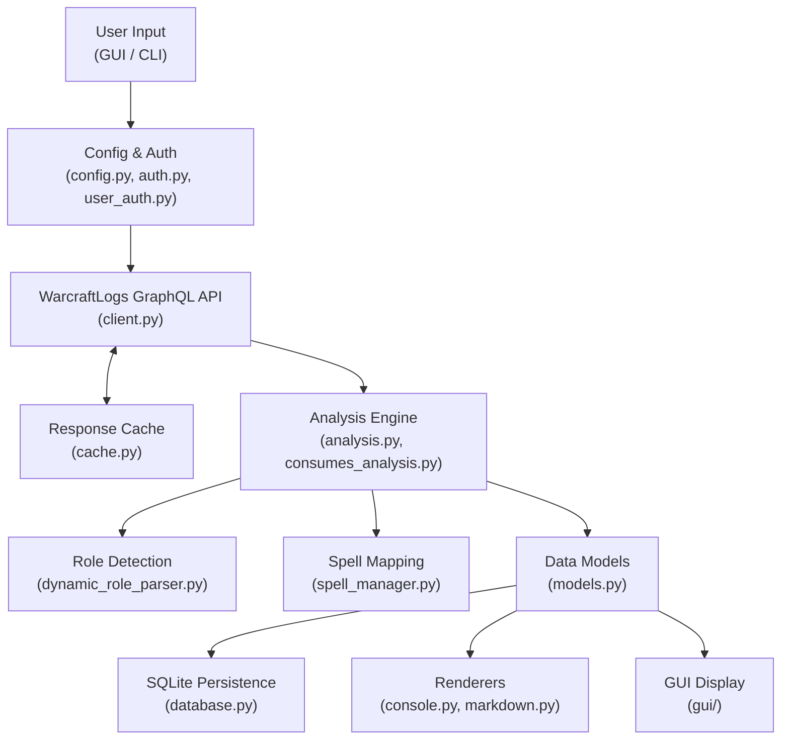
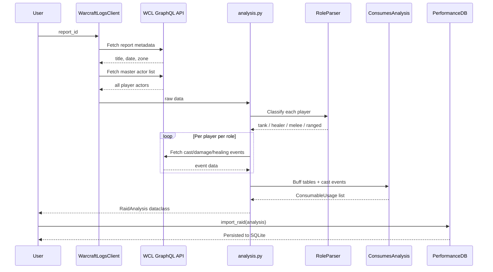
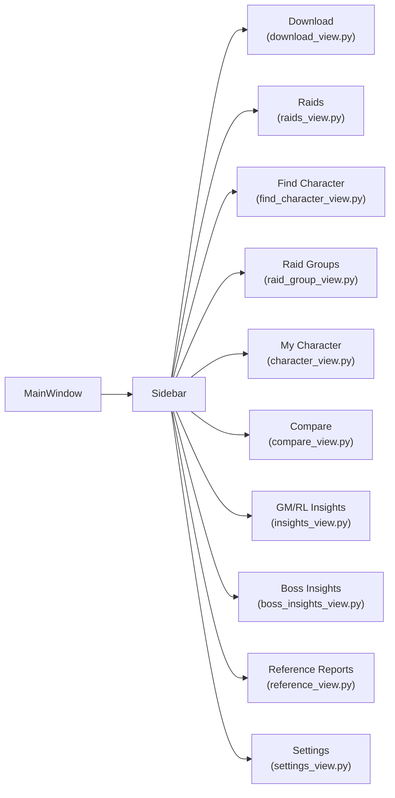
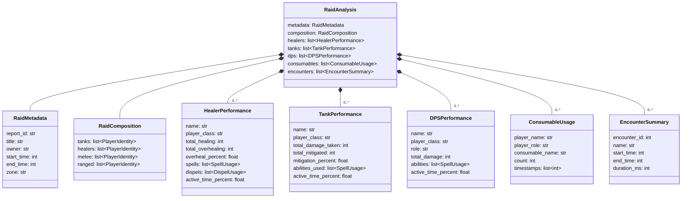
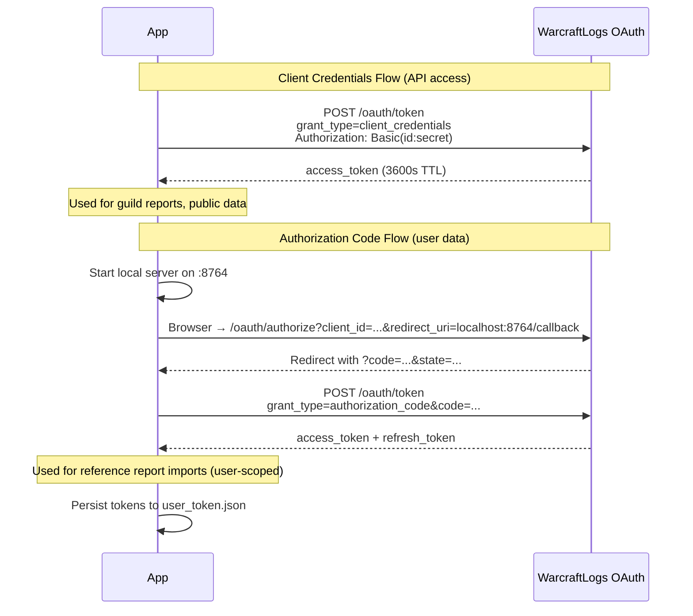
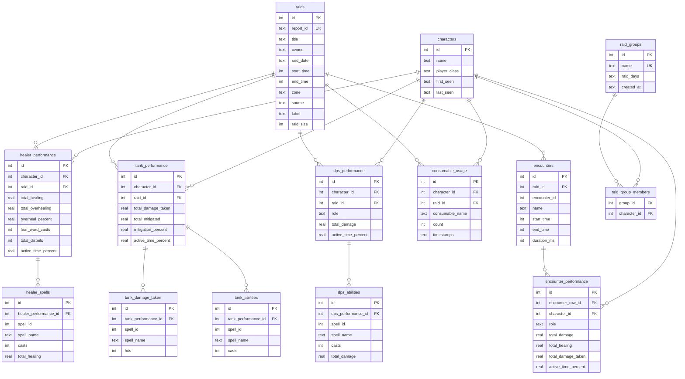

# Developer Guide

## Overview

WarcraftLogs Analyzer fetches raid performance data from the [WarcraftLogs](https://www.warcraftlogs.com) GraphQL API, runs role-based analysis (healers, tanks, melee/ranged DPS), and stores historical trends in a local SQLite database. It ships as both a CLI tool and a PySide6 desktop application.

## Architecture



## Raid Analysis Data Flow



## GUI Navigation



## Data Models



## OAuth2 Authentication

The app uses two OAuth2 flows depending on the data access level needed.



**Client credentials** (`auth.py` → `TokenManager`) provide access to public API data — guild reports, player performance, encounter data. Tokens auto-renew on expiry.

**Authorization code** (`user_auth.py` → `UserTokenManager`) provides user-scoped access needed for importing reference reports from other guilds. A local HTTP server on port 8764 captures the OAuth callback. Tokens are persisted to disk and refreshed automatically.

## Database Schema



Schema version is tracked in a `schema_version` table. Migrations run automatically in `_migrate()` on database open. Current version: **2**.

## Entry Points

| Entry Point | Command | Module |
|-------------|---------|--------|
| CLI | `warcraftlogs` | `warcraftlogs_client.cli:main` |
| Desktop App | `warcraftlogs-gui` | `warcraftlogs_client.gui.app:run` |
| PyInstaller | `launcher.py` | Direct import with absolute paths |

The CLI provides subcommands: `unified`, `healer`, `tank`, `melee`, `ranged`, `consumes`, `history`. Run `warcraftlogs --help` for details.

## Module Reference

### Core

| Module | Purpose |
|--------|---------|
| `client.py` | GraphQL API client with rate limiting (250ms throttle, exponential backoff on 429/5xx) |
| `analysis.py` | Raid analysis orchestration: role detection, performance calculation, consumable tracking |
| `database.py` | SQLite persistence with schema migrations, trend queries, raid group management |
| `models.py` | Dataclasses for all domain objects (`RaidAnalysis`, `HealerPerformance`, `TankPerformance`, etc.) |
| `config.py` | Configuration loading from `config.json` with env var overrides |
| `auth.py` | OAuth2 client credentials token management with auto-renewal |
| `user_auth.py` | OAuth2 authorization code flow for user-scoped data (reference report imports) |
| `spell_manager.py` | Spell ID-to-name mapping with rank deduplication via `spell_aliases.json` |
| `consumes_analysis.py` | Multi-raid consumable usage tracking with spike detection |
| `cache.py` | SHA256-keyed JSON file cache for API query results (`cache/responses/`) |
| `paths.py` | Path resolution for dev vs PyInstaller frozen environments |
| `character_api.py` | WarcraftLogs character profile API integration |
| `characters.py` | Character utility functions |
| `updater.py` | Auto-update checker — polls GitHub Releases, downloads and stages updates |
| `common/errors.py` | Exception hierarchy: `WarcraftLogsError`, `ApiError`, `ConfigurationError`, `DataProcessingError` |
| `cli.py` | Argument parser and CLI subcommand dispatch |

### Renderers

| Module | Purpose |
|--------|---------|
| `renderers/console.py` | Terminal-formatted raid reports |
| `renderers/markdown.py` | Markdown export with tables and sections |

### GUI (PySide6)

#### Application Shell

| Module | Purpose |
|--------|---------|
| `gui/app.py` | QApplication entry point |
| `gui/main_window.py` | Sidebar navigation with stacked views (10 views) |
| `gui/nav_stack.py` | Navigation stack for view management |
| `gui/styles.py` | Dark theme color constants and stylesheet definitions |
| `gui/worker.py` | QThread workers: `AnalysisWorker`, `ReferenceAnalysisWorker`, `GuildInfoWorker`, `GuildReportsWorker`, `CharacterProfileWorker`, `WowheadResolverWorker` |

#### Views

| Module | Purpose |
|--------|---------|
| `gui/download_view.py` | Guild report fetching with day-of-week filtering and cached indicators |
| `gui/raids_view.py` | Browse analyzed raids with encounter details |
| `gui/find_character_view.py` | Search and browse all tracked characters |
| `gui/raid_group_view.py` | Raid roster management (CRUD) with attendance and role coverage |
| `gui/character_view.py` | WCL profile integration, rankings, gear display |
| `gui/compare_view.py` | Character comparison with radar chart overlay |
| `gui/insights_view.py` | GM/RL cross-raid analytics with multi-dimension filtering |
| `gui/boss_insights_view.py` | Aggregate boss encounter performance across raids |
| `gui/reference_view.py` | Reference report imports and Head-to-Head comparison |
| `gui/settings_view.py` | API credentials, role thresholds, database management |

#### Widgets & Helpers

| Module | Purpose |
|--------|---------|
| `gui/raid_analysis_widget.py` | Tabbed raid results: role tables, consumables, Boss vs Trash, Engineering, Timeline |
| `gui/raid_list_widget.py` | Raid list browser with sorting and filtering |
| `gui/raid_cross_analysis_widget.py` | Cross-raid analysis widget |
| `gui/character_history_widget.py` | Character trend display with charts |
| `gui/detail_panel.py` | Character spell/ability detail side panel |
| `gui/update_dialog.py` | Update notification and download progress dialog |
| `gui/analysis_helpers.py` | Shared helpers: `NumericSortProxy`, engineering stats, timeline data, boss/trash classification, encounter window scoping |
| `gui/charts.py` | Line charts, radar/spider charts, calendar heatmaps |
| `gui/table_models.py` | Qt `QAbstractTableModel` implementations for tabular data |

## Key Design Patterns

**Separation of concerns**: Analysis functions (`analysis.py`) return dataclasses and never print. Presentation is handled by renderers or GUI views.

**Singleton management**: `SpellManager` and `ConfigManager` use module-level singletons with explicit reset functions for testability.

**Rate limiting**: All API calls go through `WarcraftLogsClient.run_query()`, which enforces a minimum 250ms interval between requests and retries with exponential backoff (1s, 2s, 4s) on 429/5xx responses, up to 3 attempts.

**Response caching**: GraphQL queries are cached to disk as JSON files, keyed by the SHA256 hash of the query string. The cache directory is `cache/responses/`. Cache is cleared when a raid is deleted to ensure fresh data on re-import.

**Role detection pipeline**: Players are classified by analyzing their combat events. Fixed roles (Rogue=melee, Mage=ranged) are assigned directly. Hybrid classes (Warrior, Paladin, Druid, Shaman, Priest) are classified by examining their damage profile: if >40% of damage comes from melee swings, they are melee; otherwise ranged.

**Spell deduplication**: Classic WoW has multiple spell IDs per rank. `spell_aliases.json` maps variant IDs to a canonical ID so "Greater Heal Rank 1-7" all aggregate into a single "Greater Heal" entry.

**Background threading**: All API calls from the GUI run in `QThread` workers to keep the UI responsive. Workers emit `progress`, `finished`, and `error` signals.

## Configuration

### config.json

```json
{
  "client_id": "YOUR_CLIENT_ID",
  "client_secret": "YOUR_CLIENT_SECRET",
  "report_id": "DEFAULT_REPORT_ID",
  "guild_id": 774065,
  "role_thresholds": {
    "healer_min_healing": 50000,
    "tank_min_taken": 150000,
    "tank_min_mitigation": 40
  },
  "character_name": "",
  "character_server": "",
  "character_region": "eu",
  "wcl_api_url": "https://fresh.warcraftlogs.com/api/v2/client"
}
```

Environment variable overrides: `WARCRAFTLOGS_CLIENT_ID`, `WARCRAFTLOGS_CLIENT_SECRET`, `WARCRAFTLOGS_REPORT_ID`.

### consumes_config.json

Maps spell IDs to consumable names, split by detection method:

- **buff_consumables** — detected via aura/buff tables (e.g., Haste Potion, Destruction Potion)
- **cast_consumables** — detected via cast events (e.g., Super Mana Potion, Dark Rune, Master Healthstone)

### Spell Data (spell_data/)

- `spell_names.json` — spell ID to display name mappings by category
- `spell_aliases.json` — maps rank variants to canonical spell IDs for deduplication

## Development Setup

### Prerequisites

- Python 3.10+
- A WarcraftLogs API client (create one at https://www.warcraftlogs.com/api/clients)

### Installation

```bash
git clone https://github.com/lgriffin/warcraftlogs_project.git
cd warcraftlogs_project
pip install -e ".[dev,gui]"
```

### Running

```bash
# CLI
warcraftlogs unified --report-id YOUR_REPORT_ID

# GUI
warcraftlogs-gui
```

### Testing

```bash
# Run all tests
pytest

# Run with coverage
pytest --cov=warcraftlogs_client --cov-report=term-missing

# Run a specific test file
pytest tests/test_analysis.py -v

# Reference report tests (encounter scoping, analysis helpers)
pytest tests/test_reference_reports.py -v
```

Tests use `tmp_path` fixtures for file/database isolation and `MagicMock` for API client mocking. The `conftest.py` provides shared fixtures including `mock_client`, `sample_raid_analysis`, and a temporary `db` fixture.

### Linting

```bash
ruff check .
```

## Building the Installer

### PyInstaller (Windows executable)

```bash
pip install pyinstaller
python -m PyInstaller warcraftlogs_analyzer.spec
```

Output: `dist/WarcraftLogsAnalyzer/WarcraftLogsAnalyzer.exe`

### Inno Setup (Windows installer)

Requires [Inno Setup 6](https://jrsoftware.org/isinfo.php):

```bash
iscc installer.iss
```

Output: `installer_output/WarcraftLogsAnalyzer-4.1.0-Setup.exe`

## File Locations

| Environment | Config | Database | Cache | Reports |
|-------------|--------|----------|-------|---------|
| Development | `./config.json` | `./warcraftlogs_history.db` | `./.cache/` | `./reports/` |
| Installed | `%APPDATA%/WarcraftLogsAnalyzer/config.json` | `%APPDATA%/.../warcraftlogs_history.db` | `%LOCALAPPDATA%/.../cache/` | `%APPDATA%/.../reports/` |

Path resolution is handled by `paths.py`, which detects frozen (PyInstaller) vs development environments via `getattr(sys, "frozen", False)`.

## Contributor Guide

### Adding a new GUI view

1. Create `gui/your_view.py` with a class extending `QWidget`
2. Register the view in `main_window.py`:
   - Add a sidebar item in `_build_sidebar()` with label and tooltip
   - Add the view widget to the `NavigationStack`
   - Update `set_base_count()` to reflect the new total
3. If the view needs API data, create a `QThread` worker in `worker.py` with `progress`, `finished`, and `error` signals

### Adding a new analysis tab

1. Add a new tab in `raid_analysis_widget.py` using `self._tabs.addTab(widget, "Tab Name")`
2. Add a `_populate_your_tab(analysis)` method called from `set_analysis()`
3. Use helpers from `analysis_helpers.py` for shared logic (e.g., `NumericSortProxy` for sortable tables)
4. Hide the tab if data is empty: `self._tabs.setTabVisible(index, False)`

### Adding a new consumable

Edit `consumes_config.json` and add the spell ID and name to either `buff_consumables` or `cast_consumables` depending on how WarcraftLogs tracks it. Multiple spell IDs can map to the same name for variant unification (e.g., all Master Healthstone ranks → "Master Healthstone").

### Adding a new engineering item

Add the item name to the `ENGINEERING_ITEMS` set in `gui/analysis_helpers.py`. The item must match the spell name as it appears in `DPSPerformance.abilities`.

### Adding a new spell alias

Edit `spell_data/spell_aliases.json` to map variant spell IDs to a canonical ID. This ensures all ranks of a spell aggregate into a single entry.

### Adding a new database query

1. Add the query method to `PerformanceDB` in `database.py`
2. Write tests in `tests/test_database.py` or `tests/test_database_extended.py`
3. If it needs a schema change, increment `SCHEMA_VERSION` and add migration logic to `_migrate()`
