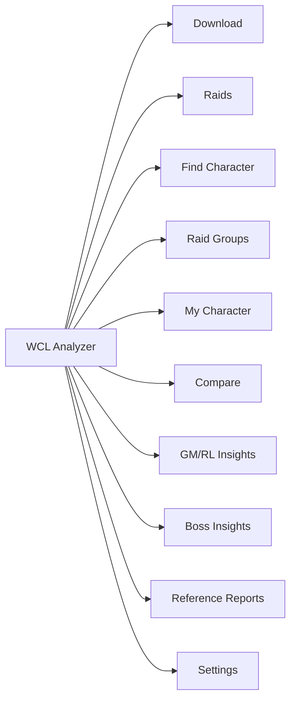

# WCL Analyzer v4.2.0 — TBC Edition

A desktop application for analyzing **Warcraft Logs** reports with a focus on **spell casts, utility usage, and consumable tracking** for The Burning Crusade Classic.

Traditional metrics are heavily influenced by gear, but **casts and abilities** offer a clearer view of player behavior, decision-making, and contribution to the raid.



---

## Windows Installer

A standalone Windows installer is available that bundles everything — no Python installation required.

1. Download `WarcraftLogsAnalyzer-4.2.0-Setup.exe` from the [Releases](https://github.com/lgriffin/warcraftlogs_project/releases) page
2. Run the installer and follow the prompts
3. Launch **WarcraftLogs Analyzer** from the Start Menu or desktop shortcut

On first launch the app copies a default config and creates a local SQLite database. All user data is stored separately from the application:

| Data | Location |
|------|----------|
| Config | `%APPDATA%\WarcraftLogsAnalyzer\config.json` |
| Database | `%APPDATA%\WarcraftLogsAnalyzer\warcraftlogs_history.db` |
| Cache | `%LOCALAPPDATA%\WarcraftLogsAnalyzer\cache\` |

Uninstalling the app does not remove user data — delete the folders above manually if needed.

The app checks for updates automatically on launch via GitHub Releases. When a new version is available, a notification dialog offers to download and apply it.

### Building the Installer

To build the installer from source:

```bash
pip install pyinstaller
python -m PyInstaller warcraftlogs_analyzer.spec
```

The runnable output is in `dist/WarcraftLogsAnalyzer/` — the `build/` directory is only PyInstaller's working area and cannot be run directly.

To create the installer `.exe`, install [Inno Setup](https://jrsoftware.org/isinfo.php) and compile `installer.iss`.

---

## Quick Start (From Source)

### 1. Install Python

- Download Python 3.10+ from [python.org](https://www.python.org/downloads/)
- During installation, **check "Add Python to PATH"**

### 2. Download the Project

```bash
git clone https://github.com/lgriffin/warcraftlogs_project.git
cd warcraftlogs_project
```

Or download and extract the ZIP from GitHub.

### 3. Install Dependencies

```bash
pip install -e ".[gui]"
```

### 4. Launch the App

**Double-click** `WCL Analyzer.bat` — no terminal required.

Or from a terminal:

```bash
python -m warcraftlogs_client.gui.app
```

### 5. Configure API Credentials

1. Go to the [WarcraftLogs API Client Management](https://www.warcraftlogs.com/api/clients/) page and create a client
2. Open the **Settings** tab in the app
3. Enter your Client ID and Client Secret
4. Set your Guild ID
5. Click **Save Settings**

---

## Features

### Desktop GUI

The full-featured PySide6 desktop app provides:

- **Download** — Fetch your guild's recent reports from WarcraftLogs and run a full raid analysis. Reports are filtered by day-of-week and show cached/saved status for previously imported raids.
- **Raids** — Browse all imported raids with encounter details. Each raid shows role-based performance breakdowns (Healers, Tanks, Melee DPS, Ranged DPS), consumable tracking, Boss vs Trash usage breakdown, Engineering Stats, and a Consumable Timeline.
- **Find Character** — Search and browse all tracked characters across your imported raids.
- **Raid Groups** — Create and manage raid groups, assign characters, set raid days, and view group dashboards with aggregated performance, attendance, and role coverage.
- **My Character** — Set up your main character to view WarcraftLogs profile data, rankings, gear, and recent reports. Links directly to your WCL profile page.
- **Compare** — Side-by-side character comparison with radar chart overlay across six dimensions.
- **GM/RL Insights** — Cross-raid analytics for guild leaders and raid leaders, with filtering by raid day, raid size, zone, and lookback window.
- **Boss Insights** — Aggregate boss encounter performance across all imported raids.
- **Reference Reports** — Import non-guild reports for benchmarking. Head-to-Head comparison shows consumable differences scoped to shared encounters, with Boss vs Trash breakdown, Engineering Stats, and Consumable Timeline.
- **Settings** — Configure API credentials, role detection thresholds, and manage the local database.

### Raid Analysis

For each raid, the analyzer automatically classifies players into roles and provides:

- **Healers**: Healing output, overhealing %, spell breakdown, dispels, resource usage
- **Tanks**: Damage taken, mitigation %, damage taken breakdown, abilities used
- **Melee DPS**: Total damage, ability breakdown with casts and damage per ability
- **Ranged DPS**: Same as melee, with automatic hybrid class detection (Shadow Priest, Boomkin, Elemental Shaman)
- **Consumables**: Per-player consumable usage with timestamps
- **Boss vs Trash**: Breakdown of consumable usage during boss encounters vs trash
- **Engineering Stats**: Engineering item tracking (Super Sapper Charge, Goblin Sapper Charge, Adamantite Grenade, Gnomish Flame Turret, Fel Iron Bomb) with min/median/max average damage per cast
- **Consumable Timeline**: Per-player timestamp visualization for any tracked consumable

### Consumable Tracking

Tracks consumable usage per player per raid:

- **Buff-based tracking** via the WCL Buffs table (protection potions, mana potions, dark runes)
- **Cast-based tracking** for specific potions with timestamps:
  - Destruction Potion, Super Mana Potion, Haste Potion
  - Master Healthstone (all rank variants unified under one name)
  - Fel Iron Bomb, Goblin Sapper Charge

Consumables to track are configured in `consumes_config.json`.

### Raid Filtering

The Insights tab supports filtering across multiple dimensions to isolate performance data:

| Filter | Options | Notes |
|--------|---------|-------|
| **Raid Day** | All Days, or specific day (Mon–Sun) | Filter by raid night |
| **Raid Size** | All Sizes, 25-man, 10-man | Based on participant count |
| **Zone** | All Zones, or specific raid instance | Dynamically populated from imported data |
| **Lookback** | All Raids, Last 5/10/15/20 | Limit analysis to recent raids |

The Zone filter scales automatically with new content — when SSC, TK, or any future raid logs are imported, they appear in the dropdown without code changes.

### Reference Reports

Import reports from other guilds for benchmarking:

- Reports are tagged with a "reference" source so they don't mix with guild data
- **Head-to-Head Comparison** — select a guild raid and a reference raid for side-by-side analysis
- Consumable data is automatically scoped to shared encounters when the guild raid covers more bosses than the reference
- Requires OAuth2 user authorization (the app opens a browser for WarcraftLogs login)

### Raid Groups

Create named groups of characters to track your raid roster over time:

- **Group Management** — Create, rename, and delete raid groups. Add/remove characters detected from imported reports.
- **Raid Days** — Select which days your group raids (Mon–Sun). The view automatically shows matching raids from your history.
- **Group Dashboard** — Aggregated performance chart, attendance tracker, and role coverage matrix for group members.
- **History Integration** — Characters show colored group tag pills. Filter the character list by raid group.

### Charts & Visualizations

- **Radar Chart** — Six-axis spider chart showing a character's relative standing (Healing, Damage, Mitigation, Activity, Consumables, Consistency) scored 0–100
- **Calendar Heatmap** — GitHub-style activity heatmap showing raid participation over the last 6 months, colored by performance intensity
- **Line Charts** — Performance trends over time per character
- **Compare Overlay** — Multiple characters on a single radar chart for direct comparison

### Local Database

All analyzed raids are saved to a local SQLite database (`warcraftlogs_history.db`), enabling:

- Performance trends over time per character
- Consumable usage history across raids
- Quick re-viewing of past raids without re-fetching from the API
- Guild report list shows which raids are already cached

The database can be cleared from **Settings > Clear Database** (requires typing "I am Toad" to confirm).

---

## Role Detection

Classic WoW / TBC does not expose role information directly, so the analyzer uses heuristics:

- **Tanks**: Warriors, Druids, and Paladins with high damage taken AND high mitigation %
- **Healers**: Priests, Paladins, Druids, and Shamans with healing above a configurable threshold
- **Hybrid DPS**: Warriors, Paladins, Druids, Shamans, and Priests are classified as melee or ranged based on their damage profile (melee swing % vs spell damage %)

Thresholds are configurable in Settings:

```json
{
  "role_thresholds": {
    "healer_min_healing": 50000,
    "tank_min_taken": 150000,
    "tank_min_mitigation": 40
  }
}
```

---

## Spell Management

Classic WoW uses multiple spell IDs for the same ability (different ranks). The spell management system handles this automatically.

### Adding Missing Spells

If you see `(ID 12345)` instead of a spell name:

```bash
python manage_spells.py add-name 12345 "Actual Spell Name" warrior_abilities
```

Or edit `spell_data/spell_names.json` directly.

### Merging Duplicate Spells

```bash
python manage_spells.py add-alias 12001,12002,12003 12000 new_spell_variants
```

Or edit `spell_data/spell_aliases.json` directly.

### Spell Management Commands

```bash
python manage_spells.py validate           # Check configuration
python manage_spells.py search "Flash Heal" # Find spells
python manage_spells.py list-categories    # Show categories
python manage_spells.py list-groups        # Show alias groups
```

---

## CLI Mode

The command-line interface is available for scripting and automation:

```bash
python -m warcraftlogs_client.cli unified --md    # Full analysis with markdown output
python -m warcraftlogs_client.cli healer           # Healer-focused analysis
python -m warcraftlogs_client.cli tank             # Tank mitigation analysis
python -m warcraftlogs_client.cli melee            # Melee DPS analysis
python -m warcraftlogs_client.cli ranged           # Ranged DPS analysis
python -m warcraftlogs_client.cli consumes raid1 raid2 --csv report.csv  # Consumables
```

Markdown reports are saved to the `reports/` directory.

---

## Config Files

| File | Purpose |
|------|---------|
| `config.json` | API credentials, guild ID, role thresholds, character settings |
| `consumes_config.json` | Consumable spell ID mappings (buff-based and cast-based) |
| `spell_data/spell_names.json` | Spell ID to name mappings by category |
| `spell_data/spell_aliases.json` | Spell rank/variant merging rules |

---

## Output

- GUI: Results displayed in interactive tables with sortable columns and charts
- CLI: Markdown files saved to `reports/` directory
- Database: SQLite file at `warcraftlogs_history.db`

Place a `logo.png` in the `reports/` folder to customise markdown output with your guild logo.
